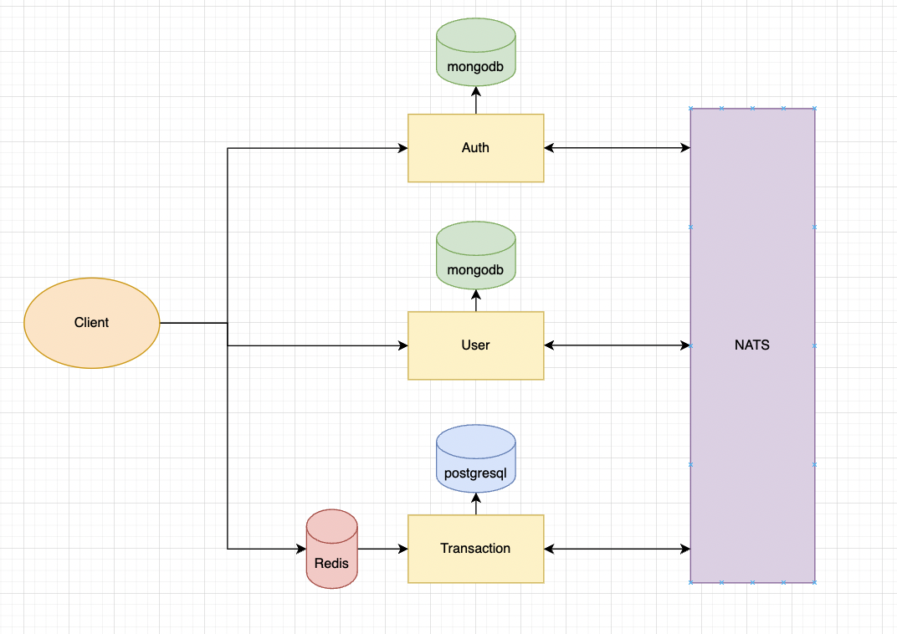
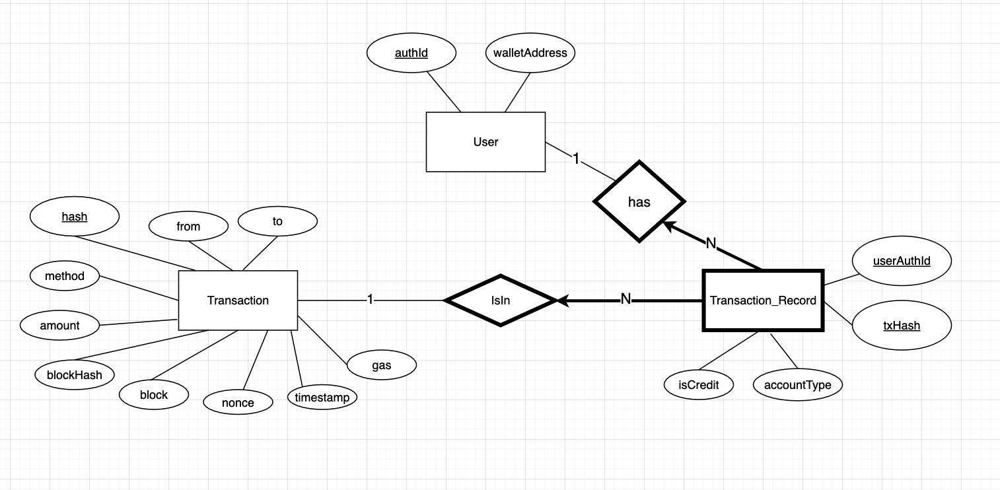

# guildfi-assignment

# Table of Content

- [Design](#design)
  - [Architecture](#architecture)
  - [Auth Service](#auth-service)
  - [User Service](#user-service)
  - [Transaction Service](#transaction-service)
- [How it works](#how-it-works)

- [How to run](#how-to-run)
  - [Prerequisites](#prerequisites)
  - [Usage](#usage)
- [Next Step](#next-step)

# Design

## Architecture

## Auth Service

- NoSQL
- Schema

## User Service

- NoSQL
- Schema

## Transaction Service

- Endpoint
- SQL
- ER Diagram
  

- Schema and example of tables storing data

  There are 3 users: A, B, and C.

  - User A connect with wallet WA01
  - User B connect with wallet WB02
  - User C connect with wallet WC03

  Suppose User A transfers 200 GEM to User B, which then transaction TX1 occurs,
  and User C transfer 100 GEM to User A, which then transaction TX2 occurs.

  Tables will look like this

### User Table

| authId | walletAddress |
| ------ | ------------- |
| A      | WA01          |
| B      | WB02          |
| C      | WC03          |

### Transaction Table

| hash | from | to   | method   | amount | gas    | block  | blockHash | nonce |
| ---- | ---- | ---- | -------- | ------ | ------ | ------ | --------- | ----- |
| TX1  | WA01 | WB02 | Transfer | 200    | 178920 | 213344 | BX213     | 33    |
| TX2  | WC03 | WA01 | Transfer | 100    | 165433 | 213345 | BX214     | 34    |

### Transaction_Record Table

| userAuthId | txHash | isCredit | accountType |
| ---------- | ------ | -------- | ----------- |
| A          | TX1    | true     | Revenue     |
| B          | TX1    | false    | Cash        |
| C          | TX2    | true     | Revenue     |
| A          | TX2    | false    | Cash        |

# How it works

## 1. Be our users

### 1.1. Create account

1. Client creates account using email, receiving back JWT token
2. Frontend attach the token to header.

### 1.2. Create User

1. Client creates user connected to the `authId`, add name, and maybe other attributes in the future.

### 1.3. Connect Wallet

1. Frontend GET certain message from the backend, pop up it to metamask, and let user sign the message to get the signature.
2. Frontend POST `/connectWallet` with `signature` and client's `walletAddress`
3. Backend will verify that the client is the real owner of `walletAddress`, and update the database of the client with `authId` attached in `JWT token`
4. User service then publishes `UserUpdatedEvent`.
5. Transaction service listens `UserUpdatedEvent` and create the user in it own database.

## 2. Doing Transaction

Once user connect wallet to our platform, they are allowed to do transaction (in fact, the platform will not record the transaction in the database because I don't really know how to prevent them from doing transaciton somewhere else, since it's blockchain XD).

### 2.1 Transfer

- From the assignment, it said in the endpoint example that `User able to transfer GEM to another user with correct permissions`
- After doing researches, I've found 4 approaches,
  1. Backend calls `transfer` with user private key
  2. Let user approve and Backend use `transferFrom` with my hardcoded private key.
  3. Frontend let client sign `transfer` transaction and send back to Backend to proceed.
  4. Frontend let client call `transfer` themselves and send back `txHash` to Backend to proceed.
- However,

### 2.2 Backend write to database with double-entry bookkeeping

-

# How to run

## Prerequisites

    node
    docker
    kubernetes
    skaffold

## Usage

# Next Step
