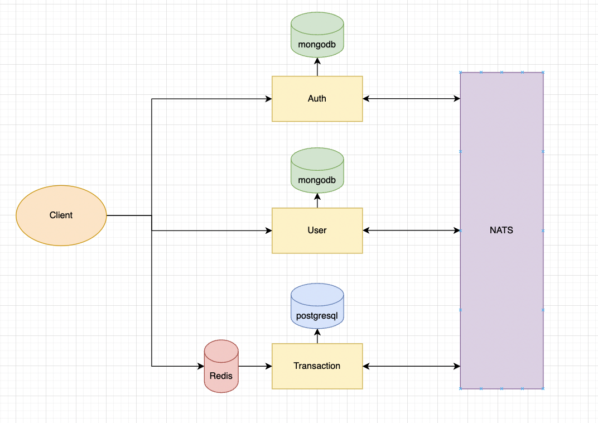
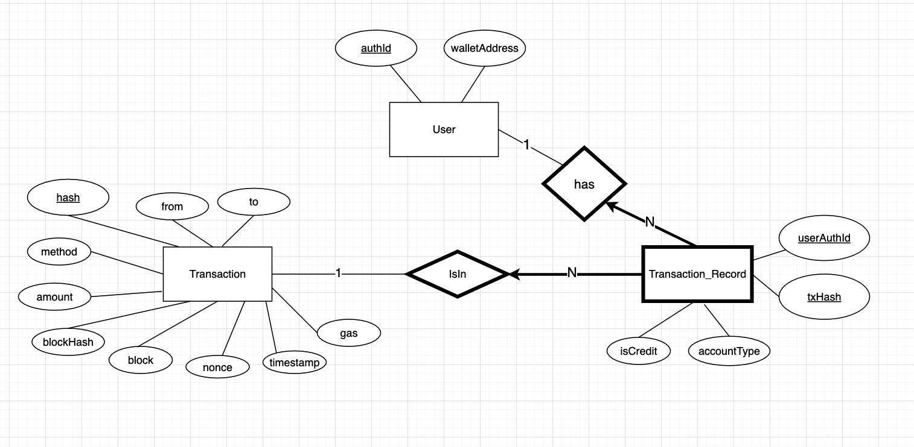

# guildfi-assignment

# Table of Content

- [Design](#design)
  - [Architecture](#architecture)
  - [Auth Service](#auth-service)
  - [User Service](#user-service)
  - [Transaction Service](#transaction-service)
- [How it works](#how-it-works)
  - [Step 1: Be our users](#step-1-be-our-users)
  - [Step 1: Doing transaction](#step-2-doing-transaction)
- [How to run](#how-to-run)
  - [Prerequisites](#prerequisites)
  - [Usage](#usage)
- [Todo list](#todo-list)
- [For scalability](#for-scalability)

# Design

## Architecture



## Endpoints

All endpoints are in this [link](https://documenter.getpostman.com/view/16305047/UyxdKpCm)

## Auth Service

Auth service is designed to seperate user authentication credentials from the user detail that might increase in the future. NoSQL database will be used in this service since the data is very simple, and to be flexible for any change in the future.

- Schema

  | authId   | email    | password |
  | -------- | -------- | -------- |
  | ObjectId | string   | string   |
  | required | required | required |

## User Service

User service is designed with NoSQL database to be flexible for any features in the future. For example, users might have connection or friends with other users, which will be store in graph data structure.

- Schema

  | authId   | email    | name     | walletAddress |
  | -------- | -------- | -------- | ------------- |
  | ObjectId | string   | string   | string        |
  | required | required | required | allowNull     |

## Transaction Service

The transaction data should be stored in SQL database due to the structure itself, especially with double-entry bookkeeping for full tracebility.

- ER Diagram

  

- Schema and example of tables storing data

  Suppose there are 3 users: A, B, and C.

  - User A connect with wallet WA01
  - User B connect with wallet WB02
  - User C connect with wallet WC03

  After that

  - User A transfers 200 GEM to User B --> returning TX1 hash
  - User C transfers 100 GEM to User A --> returning TX2 hash

  Tables will look like this

### User Table

| authId | walletAddress |
| ------ | ------------- |
| A      | WA01          |
| B      | WB02          |
| C      | WC03          |

### Transaction Table

| hash | from | to   | method   | amount | gas    | block  | blockHash | nonce |
| ---- | ---- | ---- | -------- | ------ | ------ | ------ | --------- | ----- |
| TX1  | WA01 | WB02 | Transfer | 200    | 178920 | 213344 | BX213     | 33    |
| TX2  | WC03 | WA01 | Transfer | 100    | 165433 | 213345 | BX214     | 34    |

### Transaction_Record Table

| userAuthId | txHash | isCredit | accountType |
| ---------- | ------ | -------- | ----------- |
| A          | TX1    | true     | Revenue     |
| B          | TX1    | false    | Cash        |
| C          | TX2    | true     | Revenue     |
| A          | TX2    | false    | Cash        |

# How it works

## Step 1: Be our users

### 1.1. Create account

1. Client creates account by `POST /api/v1/auth/signup`, using email, receiving back JWT token
2. Frontend attach the token to header.

### 1.2. Create User

1. Client creates user connected to the `authId`, add name, and maybe other attributes in the future. Using `POST /api/v1/user/` in user service.

### 1.3. Connect Wallet

1. Frontend `GET /api/v1/user/message` to get certain message from the backend, pop up it to metamask, and let user sign the message to get the `signature`.
2. Frontend `POST /api/v1/user/connectWallet` with `signature` and client's `walletAddress`
3. Backend will verify that the client is the real owner of `walletAddress`, and update the database of the client with `authId` attached in `JWT token`
4. User service then publishes `UserUpdatedEvent`.
5. Transaction service listens `UserUpdatedEvent` and create the user in it own database.

## Step 2: Doing Transaction

Once user connect wallet to our platform, they are allowed to do transaction (in fact, the platform will not record the transaction in the database because I don't really know how to prevent them from doing transaciton outside the platform, since it's blockchain).

### 2.1 Transfer

- From the assignment, it said in the endpoint example that `User able to transfer GEM to another user with correct permissions`
- After doing researches, I've found 4 approaches,
  1. Backend calls `transfer` with user private key
  2. Let user approve and Backend use `transferFrom` with my hardcoded private key.
  3. Frontend let client sign `transfer` transaction and send back to Backend to proceed.
  4. Frontend let client call `transfer` themselves and send back `txHash` to Backend to proceed.
- However, approach `1` is impossible since the private key should not leave the client.
  Approach `2` requires trust from client. Approach `3` This seems to be great approach since the signed transaction cannot be manipulated by anyone. Unfortunately, I can't figure out how to do it right now. Therefore, approach `4` is the only possible approach that I found and can use in this assignment.

- So, after client transferred token, browser wallet will return transaction hash. Then, Frontend can send the hash to backend, using `POST /` in transaction service, to proceed.

### 2.2 Backend write to database with double-entry bookkeeping

- Backend extract the transaction receipt from the hash. Check if those two users who did the transaction are in the platform or not. If not, it will not write the data in the database. If yes, proceed to the next step.
- For `double-entry bookkeeping`, transaction detail will be stored in `Transaction` table, and the `Transaction_Record` will seperate the transaction detail into two sides which are the `From` side and the `To` side, and store with their own `debit/credit` and `accountType`.

# How to run

## Prerequisites

    node
    docker
    kubernetes
    skaffold

## Usage

### Run all services simultaneously

```
skaffold dev
```

#### To map port outside

1. Get pods

```
kubectl get pods
```

2. Map port from the pod inside kubenetes cluster to your local machine

```
kubectl port-forward <pod> <outsidePort>:<insidePort>
```

#### To automatically map port to your local machine

```
skaffold dev --port-forward
```

- port 3001 - auth-service
- port 3002 - user-service
- port 3003 - transaction-service

#

### Run each service seperately

\*cd to each directory seperately first

1. Install dependencies

   ```
   npm install
   ```

2. Run locally
   ```
   npm run local
   ```

\*\*Note that `npm run local` will by pass database and nats environment vaiables and their connection, but you still can connect to the database with your own credentials and remove the bypass line.

## Test

\*cd to each directory seperately first

    npm run test

# Todo list

Since the project is not entirely considered finished. Here's the todo list of what I intended to finish

- Write and end-to-end test to test that all services can work together with frontend.
- Implement Redis for transaction service.

# For scalability

- The app could be deploy in any cloud provider. I implemented `logger` which will write the logs in to `log` folder inside each service. So we could grab the file from the cloud provider and debug as it increases in complexity.
- In the future, I expect that there will be more transaction type where users are not only transfer token but do something else as well. The transaction service is designed to be able to keep track of many `TransactionMethod` and `AccountType`.
  In addition, for full accounting system, we could implement a balance sheet for tracebilty as well.
